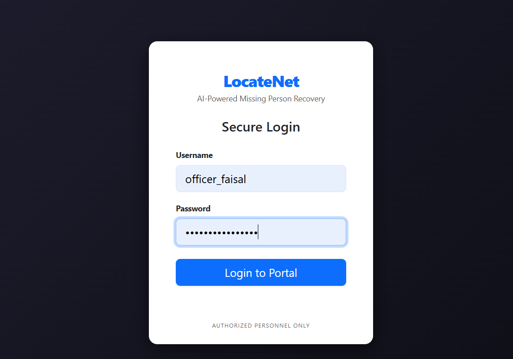
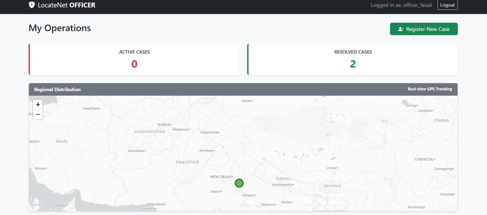
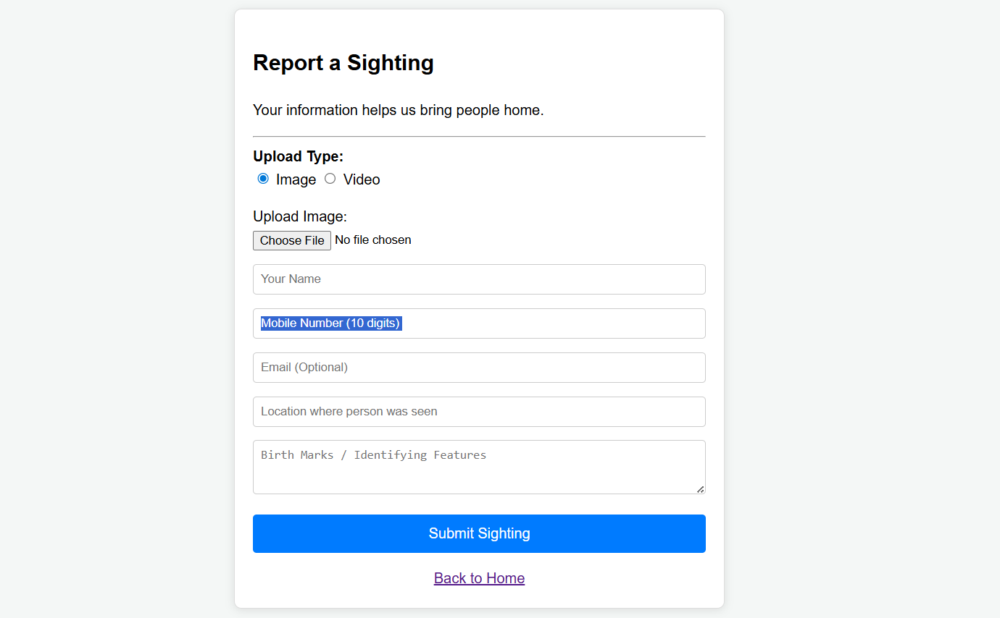
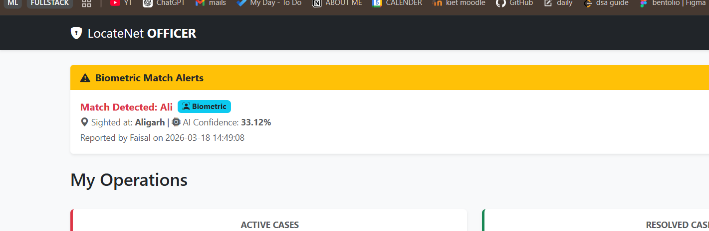
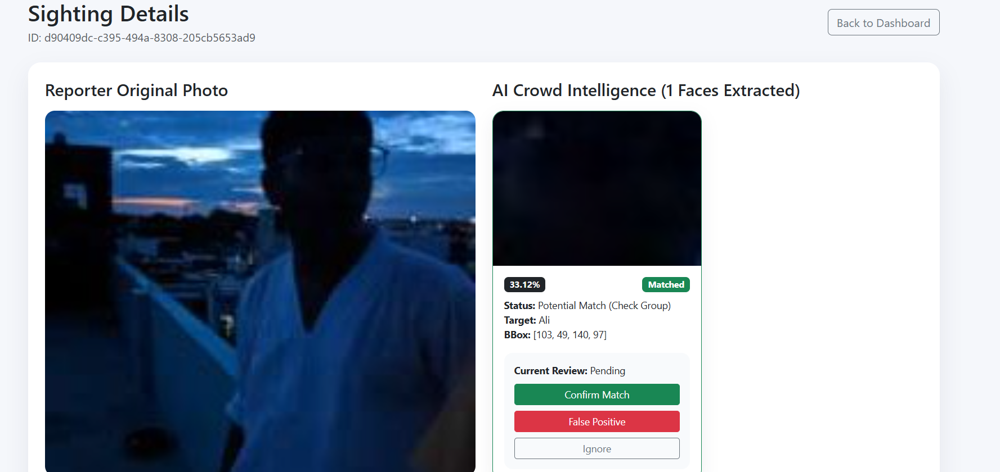

# LocateNet

<p align="center">


```

  _     ___   ____    _  _____ _____   _   _ _____ _____ 
 | |   / _ \ / ___|  / \|_   _| ____| | \ | | ____|_   _|
 | |  | | | | |     / _ \ | | |  _|   |  \| |  _|   | |  
 | |__| |_| | |___ / ___ \| | | |___  | |\  | |___  | |  
 |_____\___/ \____/_/   \_\_| |_____| |_| \_|_____| |_|  
                                                         

```

</p>


<p align="center">


</p>


LocateNet is a facial recognition and crowd-analysis system designed to help locate missing individuals.  
The platform detects multiple faces from group photos, generates biometric embeddings, and compares them against a database to identify potential matches.

---

## Features

- Detects and extracts multiple faces from crowd images
- Generates 512-dimension biometric embeddings
- Similarity search using FAISS vector indexing
- Match probability scoring (high, likely, potential)
- Officer comparison gallery for visual verification
- Geographic hotspot tracking for repeated sightings

---

## System Architecture

| Layer | Component | Description |
|------|------|------|
| Vision | InsightFace (Buffalo_L) | Face detection, alignment, and embedding extraction |
| Vector Search | FAISS | High-speed similarity search using vector embeddings |
| Backend | Flask + SQLAlchemy | REST routes and relational database mapping |
| Processing | Python 3.10+ | Image processing pipeline |
| Mapping | Folium / Geopy | Geographic visualization of sightings |

---

## Project Structure

```
LocateNet
│
├── app.py
├── init_system.py
├── models.py
│
├── pipelines
│   └── detection_pipeline.py
│
├── services
│   ├── face_service.py
│   └── alert_service.py
│
├── vector_db
│   ├── search_service.py
│   └── storage
│
├── resources
│
└── static
    └── uploads
```

---

## WORKING 
## Application Interface

### 1. Common Interface


### 2. Admin / Officer Login


### 3. Role Based Task Dashboard


### 4. Officer Registers New Case


### 5. Reporting by Public / Other Officers


### 6. Face Match Detection Notification


### 7. Officer Verification (Found / Not Found)


13) MORE PHOTOS

## Installation

Clone the repository

```bash
git clone https://github.com/faizdevx/LocateNet.git
cd LocateNet
```

Install dependencies

```bash
pip install flask flask-sqlalchemy insightface onnxruntime opencv-python faiss-cpu numpy geopy bcrypt
```

---

## System Initialization

Run initialization before the first launch.

```bash
python clean_system.py
python init_system.py
```

This creates database tables and prepares the FAISS vector index.

---

## Running the Application

```bash
python app.py
```

Note:  
`use_reloader=False` is used to prevent the AI model from loading twice and consuming additional memory.

---

## Processing Workflow

### Enrollment

1. Officer uploads a reference image
2. Face embedding (512D vector) is generated
3. Vector is stored in FAISS index
4. Database record links the vector ID to the case

### Sighting

1. Citizen uploads a group image
2. System detects all faces
3. Each face is cropped and stored

### Matching

1. Cropped faces are converted into embeddings
2. Embeddings are searched in the FAISS index
3. Matches above threshold are recorded

---

## Match Scoring

| Score Range | Interpretation |
|------|------|
| > 75% | High Confidence |
| 50–75% | Likely Match |
| 10–50% | Potential Match |

---

## Security

Cases marked as **resolved** are automatically filtered from future match alerts.  
This prevents unnecessary notifications once a person has been located.

---

## Tech Stack

- Python
- Flask
- SQLAlchemy
- InsightFace
- FAISS
- OpenCV
- NumPy
- Geopy
- Folium

---

## License

See `LICENSE` file.

---

## Author

Faizal
